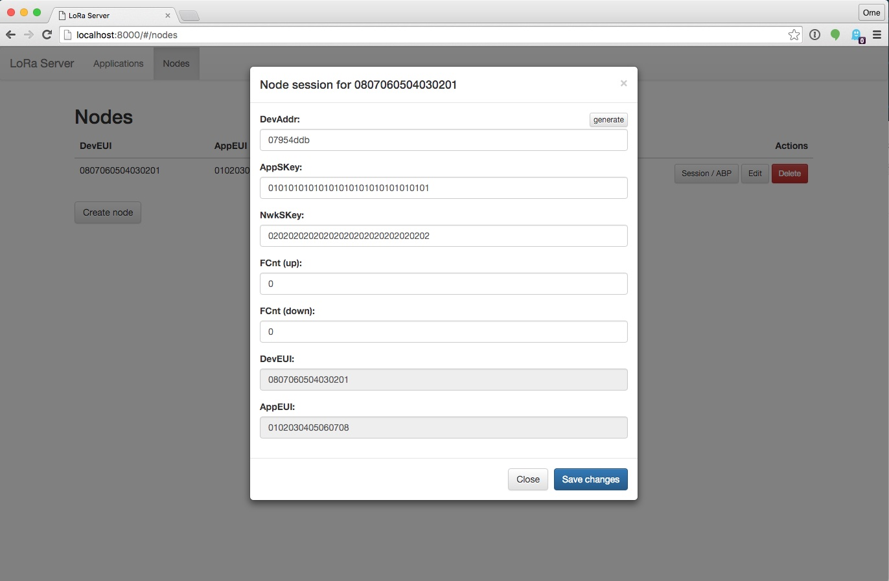

# LoRaWAN network-server

*loraserver* is a LoRaWAN network-service. It is responsible for the
communication with the LoRa gateway(s) and applications. Communication
with the applications and gateways is done over MQTT. Configuration of
applications and nodes can be done with the provided web-interface.

## Todo

Note: This project is under development. Please test and give feedback but know that things might break! 

- [x] unconfirmed data up
- [x] activation by personalization
- [x] over-the-air activation
- [x] web-interface
- [ ] auto-generated RPC documentation
- [ ] freeze initial database schema
- [ ] confirmed data up
- [ ] data down (confirmed and unconfirmed)
- [ ] handling of mac commands
- [ ] cross band (only the EU 863-870MHz ISM Band is supported right now)
- [ ] cross-platform binary build (only linux amd64 is available right now)

## Getting started

* First install the *Lora Semtech Bridge* (https://github.com/brocaar/lora-semtech-bridge)

* Download and unpack ``loraserver``: https://github.com/brocaar/loraserver/releases.

* Install a MQTT server (used for communication with the gateways and applications).
  Mosquitto is a good option: http://mosquitto.org/.

* Install PostgreSQL (used to store application and node data).

* Install Redis (used to store node sessions).

* Start the ``loraserver`` service. The ``--help`` argument will show you all the available
  config options. 

* Use the web-interface to create an application and node. You should now be able to
  use OTAA to activate your node. Alternatively, use the web-interface to activate your
  node (Session / ABP button).

* See https://github.com/brocaar/loratestapp for an example application implementation.

## Getting started (with ``docker-compose``)

An alternative way to get started (either for development or for testing this project)
is to start this project by using ``docker-compose`` (https://docs.docker.com/compose/).

After cloning this repository, you should be able to start the whole project
(including the *Lora Semtech Bridge*) with:

``docker-compose -f docker-compose.yml -f docker-compose.devel.yml up``

## API

The *loraserver* provides a JSON-RPC API over HTTP. All calls are performend by
sending a post request to the ``/rpc`` endpoint. The provided web-interface is a
sample implementation on top of this api.

## License

This package is licensed under the MIT license. See ``LICENSE``.
