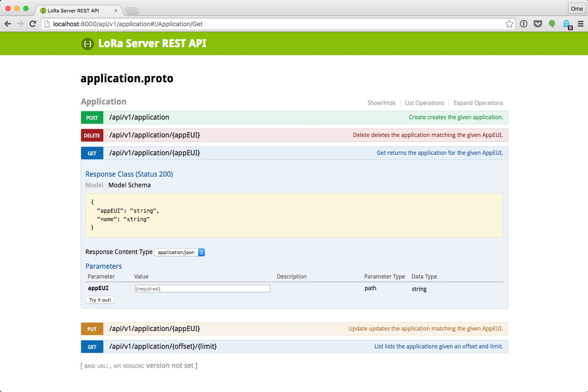

# API

LoRa Server provides a [gRPC](http://www.grpc.io/) API for easy integration
with your own platform. On top of this gRPC API, LoRa Server provides a
RESTful JSON interface, so that you can use the API for web-applications
(note that gRPC is a binary API layer, on top of
[protocol-buffers](https://developers.google.com/protocol-buffers/).

!!! info "Protocol-buffer files"
	LoRa Server provides a gRPC client for Go. For other programming languages
	you can use the .proto files inside the [api](https://github.com/brocaar/loraserver/tree/master/api)
	folder for generating clients. See the [gRPC](http://www.grpc.io/) documentation
	for documentation.


## gRPC interface

The following example in [Go](https://golang.org/) creates an application and
node using the gRPC API:

```go
package main

import (
	"log"

	"golang.org/x/net/context"
	"google.golang.org/grpc"

	"github.com/brocaar/loraserver/api"
)

func main() {
	conn, err := grpc.Dial("localhost:9000", grpc.WithInsecure())
	if err != nil {
		log.Fatal(err)
	}
	defer conn.Close()

	appClient := api.NewApplicationClient(conn)
	nodeClient := api.NewNodeClient(conn)

	_, err = appClient.Create(context.Background(), &api.CreateApplicationRequest{
		AppEUI: "0102030405060708",
		Name:   "example app",
	})
	if err != nil {
		log.Fatal(err)
	}

	_, err = nodeClient.Create(context.Background(), &api.CreateNodeRequest{
		DevEUI: "0807060504030201",
		AppEUI: "0102030405060708",
		AppKey: "01020304050607080102030405060708",
	})
	if err != nil {
		log.Fatal(err)
	}
}
```

The following clients are available:

* [ApplicationClient](https://godoc.org/github.com/brocaar/loraserver/api#ApplicationClient)
* [NodeClient](https://godoc.org/github.com/brocaar/loraserver/api#NodeClient)
* [NodeSessionClient](https://godoc.org/github.com/brocaar/loraserver/api#NodeSessionClient)
* [ChannelClient](https://godoc.org/github.com/brocaar/loraserver/api#ChannelClient)
* [ChannelListClient](https://godoc.org/github.com/brocaar/loraserver/api#ChannelListClient)


## RESTful JSON interface

Since gRPC [can't be used in browsers yet](http://www.grpc.io/faq/), LoRa Server
provides a RESTful JSON API (by using [grpc-gateway](https://github.com/grpc-ecosystem/grpc-gateway))
on top of the gRPC API, exposing the same API methods as the gRPC API.
The REST API documentation and interactive console can be found at `/api/v1`.



## Authentication and authorization

Both the gRPC and RESTful JSON interface provide an option for authentication
and authorization using JSON web tokens / [JWT](https://jwt.io). To enable
this option, make sure to start LoRa Server with the `--jwt-secret` argument
(or `JWT_SECRET` environment variable). 

An example claim illustrating the options that can be included in the token:

```json
{
	"exp": 1257894000,             // the unix time when the token expires
	"admin": false,                // admin users have access to all api methods and resources
	"apis": ["Node.Get"],          // list of api methods the user has access to
	"apps": ["0102030405060708"],  // list of AppEUIs the user has access to
	"nodes": ["*"]                 // list of DevEUIs the user has access to
}
```

For nodes and applications, besides the (hex encoded) AppEUI / DevEUI a
wildcard (`*`) can be given to give the user access to all applications
and / or nodes.


The API methods can be given as:

* `[*]`: all methods of all the APIs
* `["Node.Get"]`: listing each APIs method
* `["Node.(Get|Delete)"]`: combining multiple methods for the same API
* `["Node.*"]`: all methods of the Node API

### Setting the authentication token

For requests to the RESTful JSON interface, you need to set the JWT token
using the `Grpc-Metadata-Authorization` header field. The token needs to
be present for each request!

When using [gRPC](http://grpc.io/), the JWT token needs to be stored in the
`authorization` key of the request metadata. For example in Go, this can be
done by the [grpc.WithPerRPCCredentials](https://godoc.org/google.golang.org/grpc#WithPerRPCCredentials)
method.

## Security / TLS

By default, all API requests are performed over plaintext, meaning that
everybody is able to eavedrop. Therefore it is recommended to enable TLS.
As a side-effect, both the RESTful API and the gRPC will be served on the
same port (this is because the Go http server only enables http/2 when TLS
is enabled).
Enabling TLS can be done by providing the `--http-tls-key` and
`--http-tls-cert` [configuration](configuration.md) flags.

### Self-signed certificate

A self-signed certificate can be generated with the following command:

```bash
openssl req -x509 -newkey rsa:2048 -keyout key.pem -out cert.pem -days 90 -nodes
```

### Let's Encrypt

For generating a certificate with [Let's Encrypt](https://letsencrypt.org/),
first follow the [getting started](https://letsencrypt.org/getting-started/)
instructions. When the `letsencrypt` cli tool has been installed, execute:

```bash
letsencrypt certonly --standalone -d DOMAINNAME.HERE 
```
